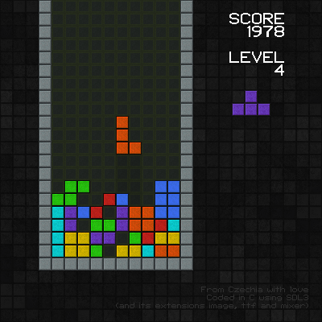

# wetris

A tetris clone written in C11 and using SDL3.

<p align="center">
  
</p>

## Building

If you're on Windows, you can obtain tetris from the
[Releases](https://github.com/inunix3/wetris/releases) page.

Create a build directory in the project root:

```
mkdir build; cd build
```

Invoke cmake something like this:

```
cmake -DCMAKE_BUILD_TYPE=Release ..
```

Currently SDL3 is not widely installable from repositories, so you'll probably need to pass
`-DVENDORED_LIBS=ON` to build SDL3 and its extensions.

If you're on Windows, you also need to pass this flag, and `-DSDLIMAGE_VENDORED=ON
-DSDLMIXER_VENDORED=ON -DSDLTTF_VENDORED=ON` too.

Next build the tetris:

```
cmake --build .
```

After a successful building, binary `wetris` will be lying in the src directory.

### Installation

If you like my tetris, you can also install it from the build directory:

```
sudo cmake --install .
```

## Controls

| Key           | Action                  |
|---------------|-------------------------|
| `escape`      | Quit                    |
| `a` / `left`  | Move left               |
| `d` / `right` | Move right              |
| `q`           | Rotate counterclockwise |
| `e`           | Rotate clockwise        |
| `s` / `down`  | Speed up falling        |
| `space`       | Drop                    |
| `p`           | Pause                   |

## Contribution

If you have found a problem or have a suggestion, feel free to open an issue or send a pull request.
I'd appreciate it.

## License

wetris is licensed under the [MIT license](LICENSE.md).
